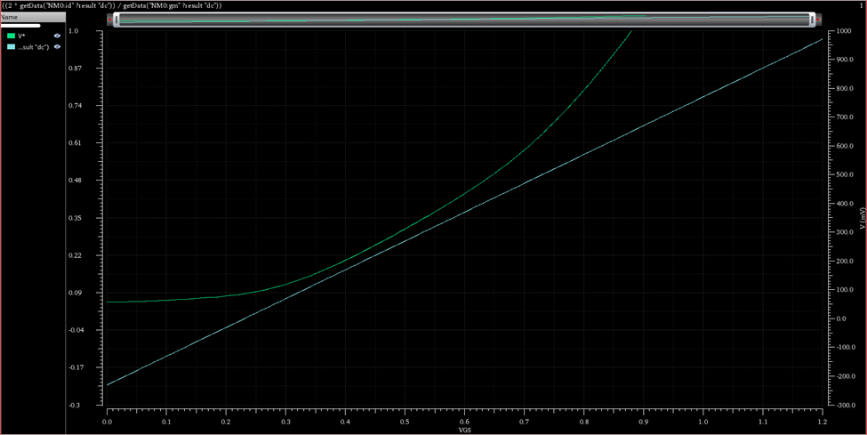
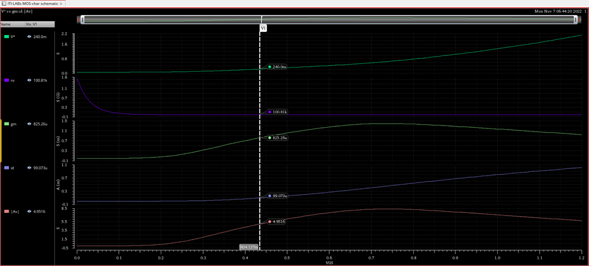
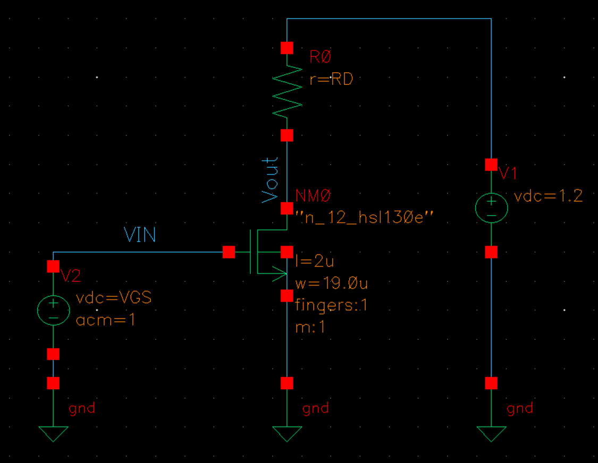
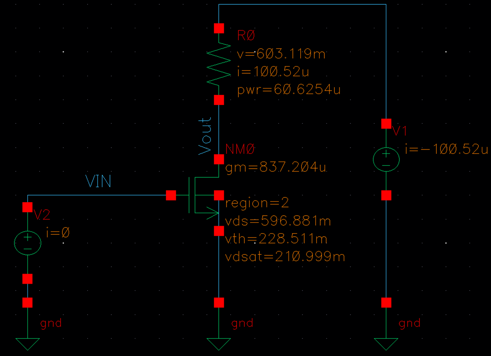
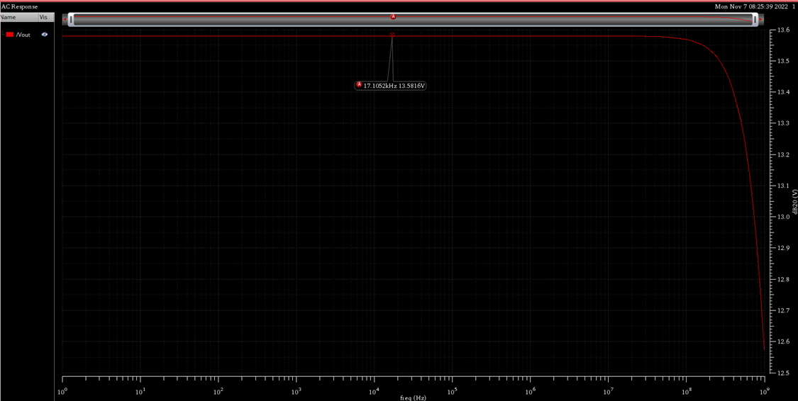
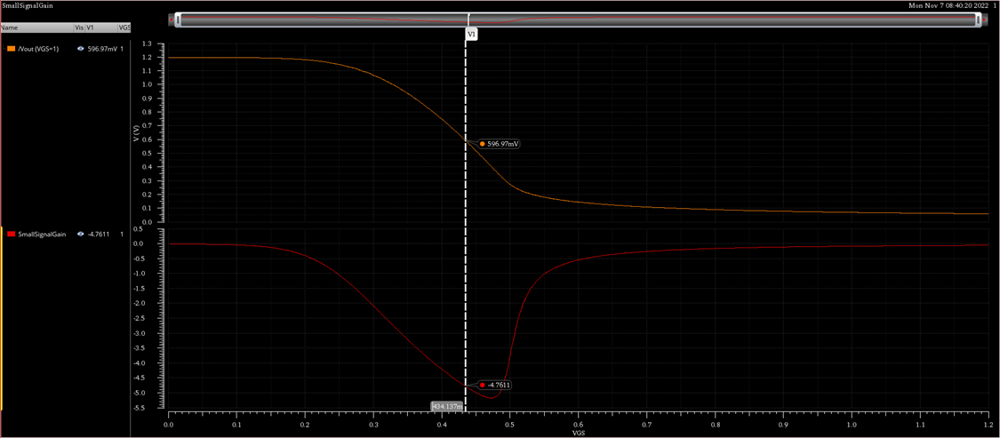
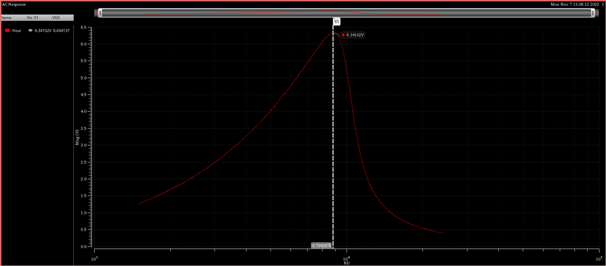

# ITI Labs : [Lab 02 ](https://drive.google.com/file/d/1rNrEmHf4pcL-3118wEzCEj8QTf8mB8ga/view?usp=drive_link)
# Common Source Amplifier

## Content 

* [Objectives](#objectives)
* [Part I: Sizing Chart](#part-i--sizing-chart)
* [PART 2: CS Amplifier](#part-ii--cs-amplifier)
* [Summary](#summary)

## Objectives 

* Design and simulate a common-source amplifier.
* Learn how to generate and use design charts.
* Investigate gain non-linearity; the variation of the gain with input signal amplitude.
* Study the maximum gain attainable for a resistive-loaded CS amplifier and the effect of supply scaling on max gain.
* Learn how to use feedback to reduce non-linearity (gain linearization).

-------------------

## Part I : Sizing Chart

|Spec|0.13 um CMOS|
|----|------------|
|DC Gain|-5|
|Supply|1.2|
|Currnet Consumption|100 uA|

* **Design Steps** 

|Design Parameters|
|-----------------|
|RD|
|W/L|
|Vgs or V*|

1. The first design decision is to choose 𝐿. Since there is no spec on bandwidth (speed), we may choose a relatively long 𝐿 to provide large 𝑟𝑜 and avoid short channel effects. Assume we will choose **𝐿=2𝜇𝑚**.

2. From Gain : 
    *  |𝐴𝑣|=gm(RD||ro)≈𝑔𝑚𝑅𝐷 ≈ (2𝐼𝐷/𝑉𝑜𝑣)×𝑅𝐷 ≈ 2𝑉𝑅𝐷/𝑉𝑜𝑣 (based in square law)
        * $|𝐴𝑣| ≈ 2𝑉_{𝑅𝐷}/𝑉*$ (based on simulation results (V*) ) 
3. The choice of 𝑉𝑅𝐷 is constrained by the output signal swing(Supplay Limited). Since we usually want to provide large output swing, we choose the common-mode (CM) output level (DC output level) around 𝑉𝐷𝐷/2. so VRD = 1.2 - 0.6 = 0.6 V
    * $V_{RD} I_D * R_D$ 
    * $ R_D = \frac{0.6v}{100μA} = 6kΩ $
4. $ V^* = \frac {2𝑉_{𝑅𝐷}}{|𝐴_𝑣|} = (2*0.6)/-5 = 240 mV$
5. The remaining variable in the design is to calculate 𝑊. square law is not accurate so using sizing chart instead of.

    * MOSFET Characteriztion Testbench

    

    * Note this is the difference between the $V_{ov}$ and $V^*$
        * In the moderate inversion they almost the same but in strong and weak inversion not

    

     

    *  As the ID is linearly proportional to W so we can assume W = 10um, and get the current 
    
    |||
    |--|--|
    |W1 = 10 |ID1 = 51.89uA|
    |W2 = ??|ID2 = 100 uA|
    so we can get W = (W1 * ID2)/ID1 => W = 19um
6. VGS = 434.137 mV

* **NOTE** : Note that 𝑔𝑚 is also proportional to 𝑊 as long as 𝑉𝑜𝑣 is constant. On the other hand, 𝑟𝑜=1/𝑔𝑑𝑠 is inversely proportional to 𝑊 (𝐼𝐷) as long as 𝐿 is constant.

-------------------------
## Part II : CS Amplifier

### 1. OP and AC Analysis

* As noticed the small signal parameters and currents and voltages as designed in part I 

* AC analysis

-------------------------
### 2. Gain Non-Linearity

* The higher graph is for Vout vs Vin (VGS) and the lower is the gain ($\frac {∂Vout}{∂Vin}$) vs Vin
    * As observed the gain is not constant, it depends on the input voltage level

-------------------------
### 3. [Optional] Maximum Gain

* This is an AC analysis at only one frequency (F=1Hz for example) and sweep the $R_D$ values to get the gain vs $R_D$ to get the $R_D$ value that give the max gain

-------------------------
### 4. [Optional] Gain Linearization (feedback)

-------------------------
## Summary 

### The Required vs The Acheived Specs

|Spec|Required|Acheived|Comment|
|-|-|-|-|
|Gain|-5|-4.77|the gain is less designed because the assumption we did $R_{out} = R_{D}\|\|r_{o} ≃ R_{D} $
|Power Consumption|100μA||100.52μA|

 