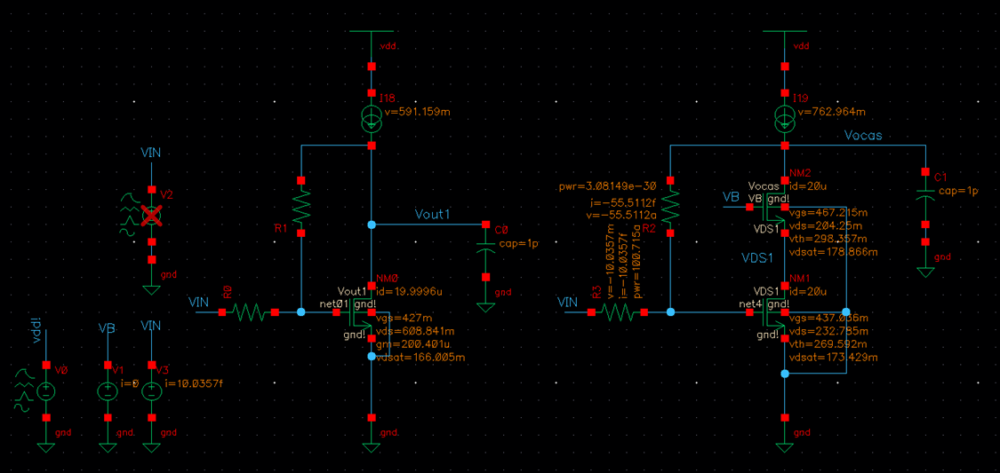

# ITI LABs : [Lab 03](https://drive.google.com/file/d/1gZrEwM5FXIxPB741rsTVFyRjbWa4eTry/view?usp=drive_link)
# Cascode Amplifier

## Content 

* [Objectives]()
* [Part I: Sizing Chart]()
* [Part II : Cascode For Gain ](#part-ii--cascode-for-gain)
* [Part III : Cascode For Bandwidth](#part-iii--cascode-for-bandwidth)

------------------

## Objectives 

* Design and simulate a cascode amplifier.
* Learn how to generate and use design charts.
* Study the biasing of the cascode amplifier.
* Investigate the gain, the bandwidth, and the GBW of a cascode amplifier.

## Part I : Sizing Chart

|Specs|0.13um CMOS|
|-----|-----------|
|L|$0.5um$|
|V*|$200mV$|
|Supply|$1.2V$|
|Current Consumption|$25uA$|
|CL|$1pF$|

|Design Parameters|
|-----------------|
|$W_1$ for input device|
|$V_{GS}$|
|$V_B$ bias Voltage for the  cascode device|

* ($\frac {W}{L}$)2  for the cascode device = 
($\frac {W}{L}$)1

----------------------
### **Design Steps**

* MOSFET Characterization Testbench 

1. From V*(200mV) vs VGS and assume W=10um ,we get ID, gm, gds  

    
|||
|---|---|
|W=10um|ID=from chart|
|Wnew|ID=20uA from spec|

  * **W = 1.4u** and **VGS = 427.47mV**

--------------------------------------
## **Part II : Cascode For Gain**

1. **OP Analysis**  
----------------------

* **Note: Chossing VB. Sweeping VB**
  * Choose VB , sweep VB to get the VDS of M1 > V* + 100mv(margin) , but unachievable as if VDS1 = 300mV M2(cascode device) will be in triode so I chose VB = 700mV VDS1 = 232mV and Vdsat1 = 173.4mV as margin about 60mV from triode VDS2= 204.25mV and Vdsat2 = 178.886mV as margin about 25mV  that the best choice I can get now to make all transistors work in saturation region. 

* The small signal parameters and currents, voltages

* **Note**: The feedback purpose is that Vocas is high impedance node so any mismatch in the currents of  M1, and M2 will pull the Vocas to GND or VDD 
  * Note again the feedback is diode connected in DC analysis

* **Note**: “vdsat” is the minimum drain-source voltage required to bias the transistor in saturation. It is equal to 𝑉𝑜𝑣 for a square-law device. It is also referred to as “vdss” (drain-source saturation voltage).

2. **AC Analysis**
----------------------

* Gain for both CS and cascode CS in dB

* Gain for both CS and cascode CS 

](image-7.png)

--------------------------------------------
## **Part III : Cascode For Bandwidth**

* **Testbench**
  * **Note**: the feedback connection is removed because the output node became well-definded nodes 

* Choosing RD  = VDD/2 , ID = 20 uA >>> RD = 30kΩ

* **Conclusion**
----------------------
  * The dominant pole in cascode for bandwidth is the input becuase it is the high impedance node 
  * The GBW is not the same as the the dominant pole is different node in the two cases (cascode for gain and bandwidth) 

|CS|
|--|
|gm = 196.165u|
|gds = 3.90281u , ro = 256.226 kohm|
|Av = gm(ro\|\| RD) = 5.268 |
|cgd = 407.8a |
|cgs = 5.30612f |
|Rsig = 10 Mohm |
|Fpd,in = 1/(2*π*Rsig(Cgs +Cgd(1-Av))) = 2.026 MHz, Simulation = 1.9MHz|
|GBW = UGF = 5.268 * 2.026 = 10.67 MHz, Simulation = 10.1991MHz, UGF = 10.0084MHZ|

|Cascode for Gain|
|--|
|gm = 179.446u |
|gds1 = 7.0315um, ro1 = 142.22kohm  ,gds2 = 4.157u , ro2 =240.558 kohm|
|Av = gm * RD = 5.38 , Simulation = 5.187 |
|cgd = 443.804a |
|cgs = 5.31306f |
|Rsig = 10 Mohm |
|Fpd,in = 1/(2*π*Rsig(Cgs +2Cgd)) = 2.57 MHz, Simulation = 2.434MHz|
|GBW = UGF = 5.268 * 2.026 = 13.33 MHz, Simulation = 12.65 MHz , UGF = 12.4252M|

