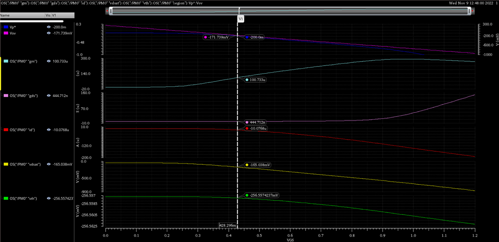

# # ITI LABs : [Lab 04](https://drive.google.com/file/d/1pON_qrcWfRWUzRE3pHoB00ChiGW5FB2p/view?usp=drive_link)
# Common Drain Frequency Response

## **Content** 

- [# ITI LABs : Lab 04](#-iti-labs--lab-04)
  - [**Content**](#content)
  - [**Objectives**](#objectives)
  - [**Part I : Sizing Chart**](#part-i--sizing-chart)
  - [**Part II : CD Amplifier**](#part-ii--cd-amplifier)

## **Objectives**

* Design and simulate a common-drain amplifier.
* Learn how to generate and use design charts.
* Learn how to do ac, DC, and transient simulations of a CD amplifier.
* Investigate the ringing and peaking problem in a capacitive-loaded CD amplifier with a large signal source resistance (Rsig) and learn how to solve it.
* Use PMOS input transistor to avoid body effect in a CD amplifier.

## **Part I : Sizing Chart**

|Parameter|0.13um|
|---------|------|
|Input Transistor|PMOS|
|L|1um|
|V*|200mV|
|Supply|1.2V|
|Current Consumption|10uA|

* **MOSFET Characterization Testbench**

|Design Parameter|Value|
|----|-----|
|W |7um|
|VGS|428.296mV|

## **Part II : CD Amplifier**

* **Testbench**

1. **Operating Point Analysis : OP**
----------------------

2. **AC Analysis**
----------------------
* **Gain VS CL and sweep  CL 2, 4, 8 pF** 
* $Q= \sqrt {\frac {gm \times (Cgs+Cgd) \times Rsig}{C_L} }$
    * As the load increases Q decreases so goes away from underdamping condition   

* **Peaking VS CL**
    * as Q decreases the peaking too

* **Gain VS RsigL and sweep  Rsig 20k, 200k, 2M** 

* **Peaking VS Rsig**

* gm = 100.836us , gmb = 21.05us 
    * Av = gm * 1/(gm + gmb) = 0.83 

* Cgs = 53f , Cgd = 2.2f , CL = 2pf
    * $Q= \sqrt {\frac {gm \times (Cgs+Cgd) \times Rsig}{C_L} } = 2.36$  >> OverShoot = 50.6%
    * @CL = 4pf, Q = 1.668 
    * @CL = 8pf, Q = 1.179
    *  
|CL|Q|
|--|-|
|2p|2.36|
|4p|1.668|
|8p|1.179|

* Rsig = 2Mohm

|CL|Q|OverShoot|Simulation Overshoot|
|--|-|---------|--------------------|
|2p|2.36|50.6%|41%|
|4p|1.668|37.26%|33.29%|
|8p|1.179|22.96%|18.9%|

*  CL = 2pF

|Rsig|Q|OverShoot|Simulation Overshoot|
|--|-|---------|--------------------|
|2M|2.36||50.6%|
|200k|0.746|5.86% almost Critical Damped|
|20k|0.24|0% Over Damped|

3. **Transient Analysis**
----------------------
* CL 2, 4, 8 pF

* Rsig 20k, 200k, 2M

4. **Zout Inductive Rise**
----------------------

* **Testbench** 

* Performing AC analysis and plot Vout when Iac =1 (the current source instead the load, to give $Z_{out} = \frac {V_{out}}{I_{ac}}$)
    * In frist part of the Zout almost equals 1/gm = 9.91kohm 

* in dB

* **Zout Comparison**
-----------------------

|Analyticaly|Simulation|
|-|-|
|@Low Freq Zout= 1/gm = 9.91KΩ|9.95KΩ||
|@High Freq Zout= Rsig = 2 MΩ|205KΩ as the Zout fall because the Cgd will doninate before reaches to ~ 205KΩ|

