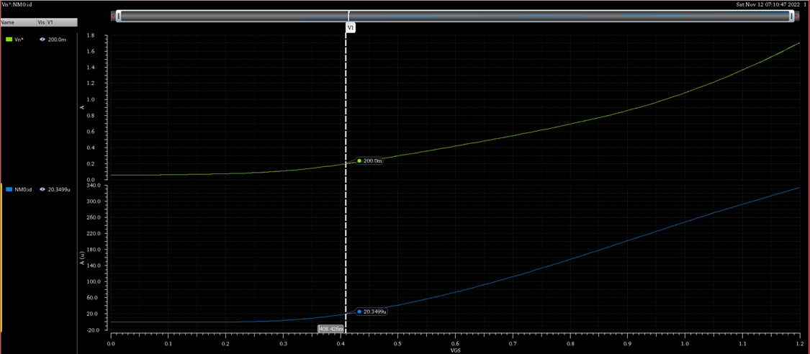
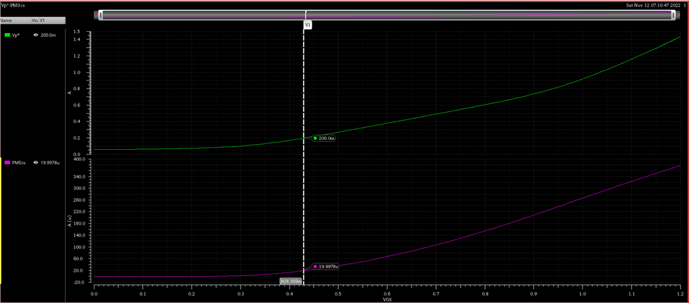
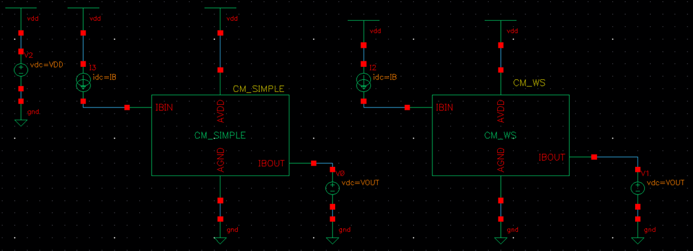
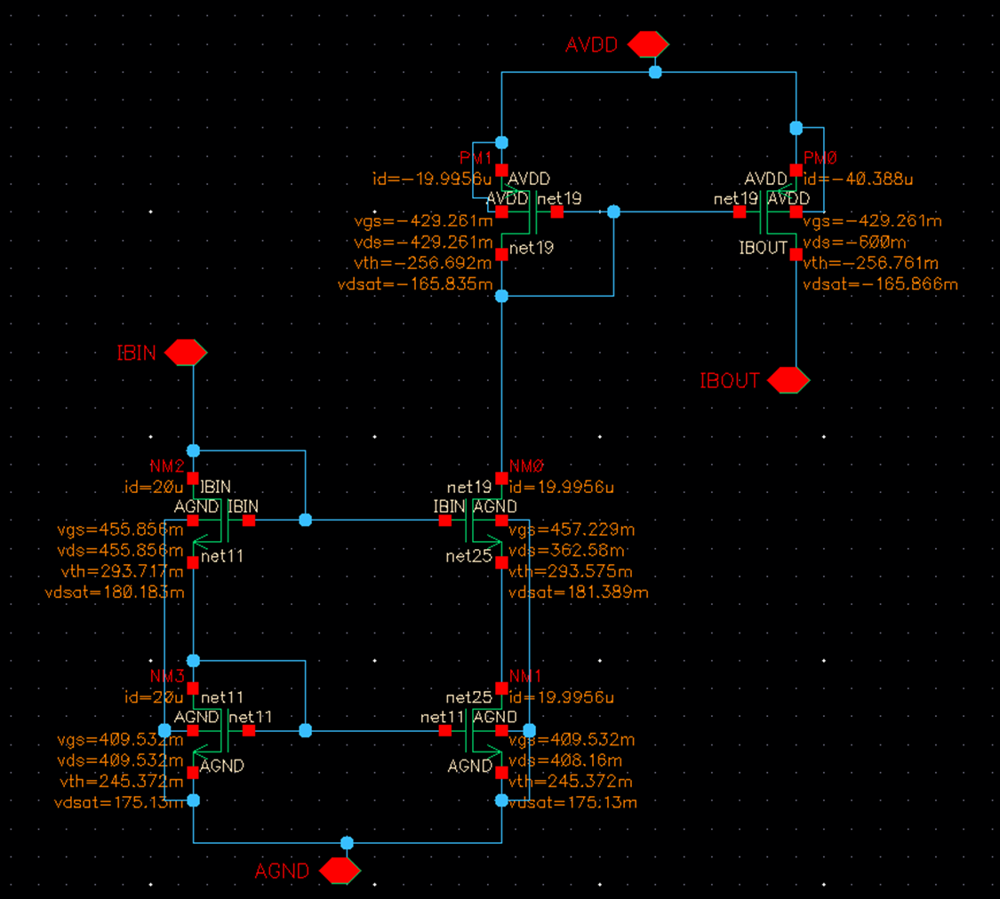
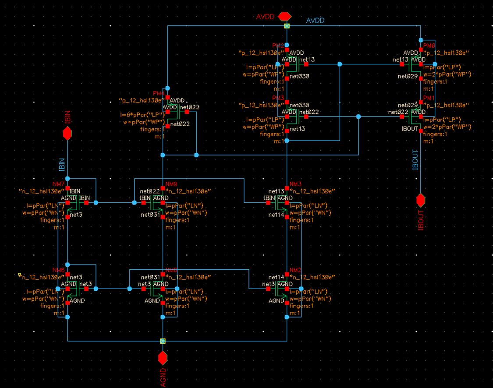
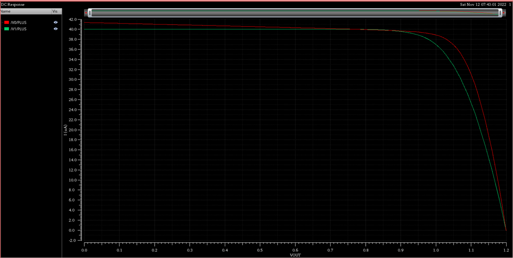
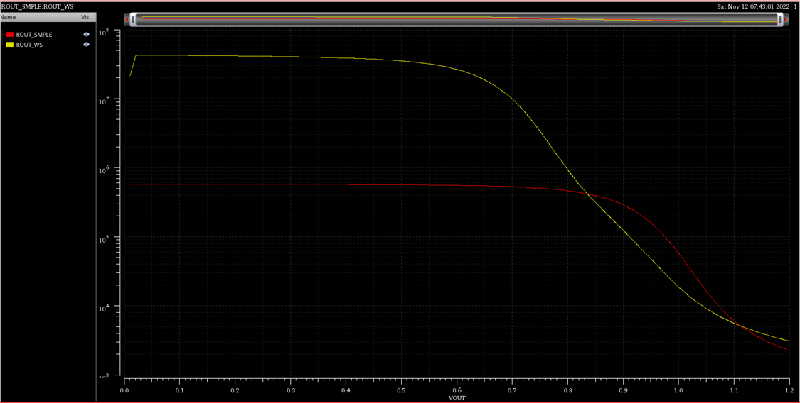

# ITI LABs : [Lab 05](https://drive.google.com/file/d/1YSL6CpFM57gZGhGUivFq9eUMq1y8dxBR/view?usp=drive_link)
# Simple vs Low Compliance Cascode Current Mirror

## Content 

* [Objectives](#objectives)
* [Part I : Sizing Chart](#part-i--sizing-chart) 
* [PART 2: Current Mirror](#part-2-current-mirror) 

----------------------------
## **Objectives**

* Design and simulate low-voltage and simple current mirrors.
* Compare low-voltage and simple current mirrors.
* Learn how to use hierarchical design.

----------------------------
## **Part I : Sizing Chart**

|Parameters|Value|
|-|-|
|L|1um|
|V*|125mV|
|VDD1.2V|
|Current Consumption|20uA|

* **MOSFET Characterization Testbench**

* **Sizing**
    * NMOS Chart

* PMOS Chart

|Design Parameters|Values|
|-|-|
|Wn|2.8um|
|VGSn|408.426mV|
|Wp|13.82um|
|VGSp|428.369mV|

----------------------------
## **PART 2: Current Mirror**

* **Testbench**

1. **DCOP**

* Simple Current Mirror

* Cascode Current Mirror 

2. **DC Sweep (Vout)**
    * To calc the compliance range of the current mirror
    * The simple current mirror has wider compliance range as there is one transistor in the stack but the cascode current mirror has two in the stack so need more one Vov

3. **Check The Error In The Current**
    * The relative error in the current is = $\frac {|I_{{B}_{ideal}} - I_{{B}_{actual}}|}{I_{{B}_{ideal}}}$

* The error as a percentage (relative error x 100%) 

* As observed the cascode current mirror has almost constant bias current because it has a largeer output resistance so $ΔI = \frac {ΔV_{out}}{ΔR_{out}}$ so any variation in Vout will be translated to very small variations in the current

