# ITI LABs : [Lab 06 : Differential Amplifier](https://drive.google.com/file/d/1kGme3SUjDp4RoAbOA06zQOiNcf3Vp7SV/view?usp=drive_link)

## Content 

* [Objectives](#objectives)
* [Part I: Sizing Chart](#part-i) 
* [Part II: Differential Amplifier ](#part-ii--differential-amplifier) 

----------------------------
## Objectives 
* Design and simulate a differential amplifier.
* Learn how to simulate the small-signal differential characteristics of a differential amplifier.
* Learn how to simulate the small-signal common-mode characteristics of a differential amplifier.
* Learn how to simulate the large-signal differential characteristics of a differential amplifier.
* Learn how to simulate the large-signal common-mode characteristics of a differential amplifier.

----------------------------
## Part I 

|Parameters|Value|
|-|-|
|L|1um|
|CM output level|0.5V|
|Differential Gain|5|
|VDD|1.2V|
|Bias Current(ISS)|40uA|

* **MOSFET Characterization Testbench**
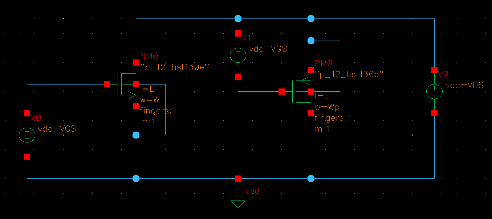

* **The Differential Amplifer Topology** 
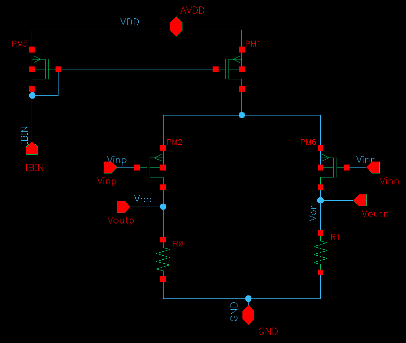

* Firstly, Choose 𝑅𝐷 to meet the CM output level spec "500mV".
    * $I_D=I_{ss}/2 = 20μA$
    * So $R_D=500mV/20μA = 25kΩ$
    * Note: ISS*RD must be smaller than (VDD – 𝑉𝑑𝑠𝑎𝑡3) for proper large signal characteristics (why?)
        * because the VDS↓ (current source) till goes out the saturation  
* Secondly, $V^{*}=\frac{2V_{RD}}{A_v}= 200mV$ 
* Sizing the diff pair according to that
    * **W=13.86μm**

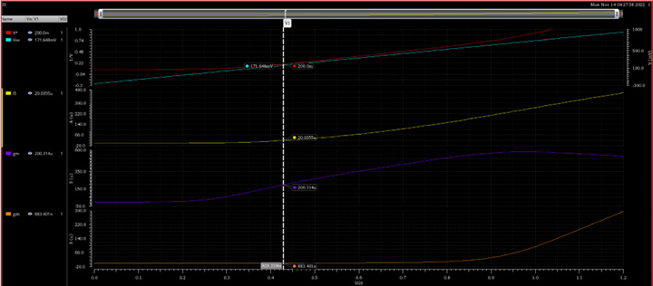

* The current source size is the double of the diff pair 

* The sized diff amp

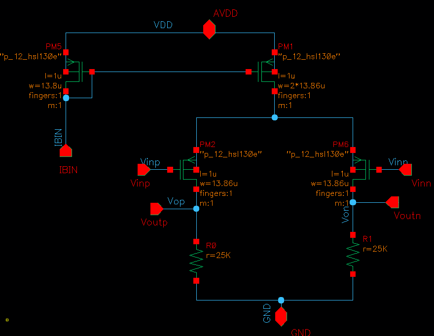

----------------------------
## Part II : Differential Amplifier 

* **Testbench**
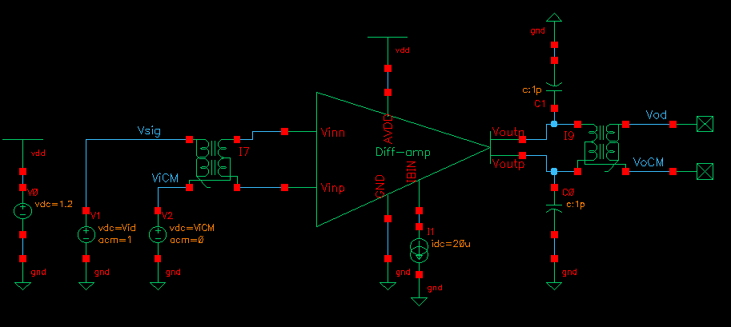

1. **OP Simulation**
    * The CM as designed and the currents and the voltages and all devices in the saturation region "2"

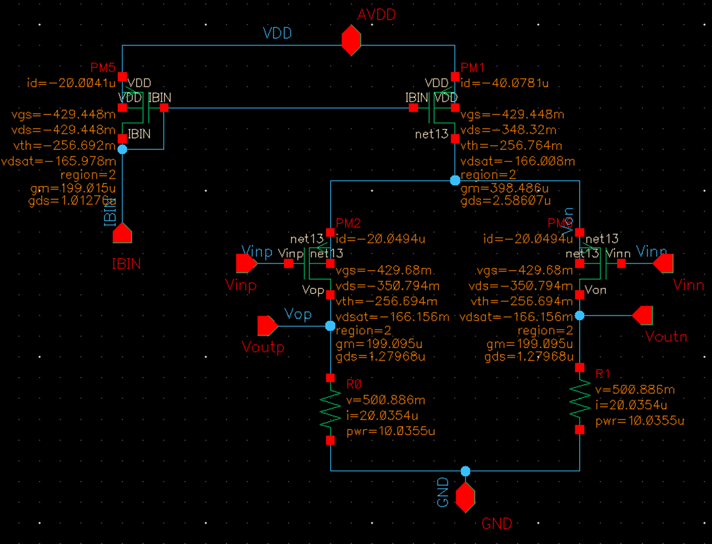

2. **Differential Small Signal c'cs**
3. **CM large signal c'cs**

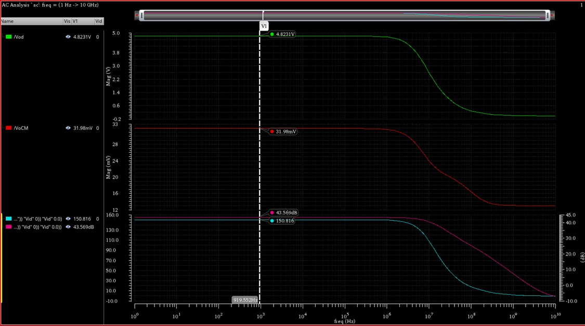

* Differential AC magnitude = 1 , and CM AC magnitude = 0

* Avd = -gm*RD= -200us * 25kohm = -5

* BW = 1/(2π*RD*Cout) , Cout = CL+ Cdb + Cgd(1-Ao) = 1p + 10.5f + 4.5 * 6 
    * BW = 6.136 MHz 

||Analytical|Simulation|Comment|
|-|---------|----------|-------|
|Avd |-5 |4.823|Gain is less than expected as ro is neglected|
|BW | 6.13MHz |6.466MHz|BW is higher than expected as ro is neglected |

* CM AC magnitude = 0, Differential AC magnitude = 1 

* AvCM = (-gm*RD)/(1+2gm*Rss) 
    * gm = 200 us, RD = 25 kohm, Rss = 1/2.586us =386.7 kohm
    * AvCM = 0.032
* CMRR = Avd/AvCM = 5/ 0.032 = 156.25 
    * of CMRR ≈ 2*gm*Rss = 2 * 200us * 386.7 kohm = 154.68 

    * CMRR BW 
        * ωp = 1/(Rss*Cp) , Cp = Cdb3 + Cgd3 + Csb1 + Csb2 =  21f + 9f + 17.77 * 2 = 65.54 fF, Rss =386.7 kohm
            * fp = 1/(2π*Rss*Cp)  = 6.279 MHz , simulation 10.39MHz
||Analytical|Simulation|
|-|---------|----------|
|AvCM|0.032|0.03198|
|CMRR|154.68|150.816|

4. **Differential Large Siganl ccs** 
* Vid = -VDD:10m:VDD. Set Vicm at the center of the CMIR.

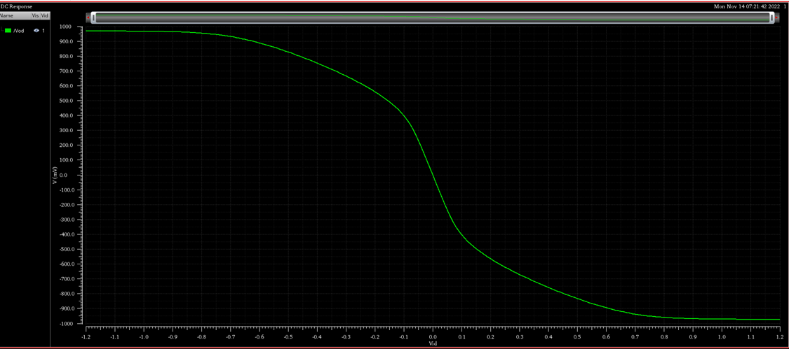

* @vid = -1.2 , Vod = Iss*RD = 40uA * 25Kohm = 1 Volt 
* @vid = 1.2 , Vod = -Iss*RD = 40uA * 25Kohm = -1 Volt 

||Analytical|Simulation|
|-|---------|----------|
||1 : -1 |970mV : -970mV|

5. **CM large signal ccs (region vs VICM)**

* CMIR analytically
    * -|VGS1|+|VDsat1|+VRD =< ViCM <= VDD -|VGS1|-|VDsat3|
    * VGS1 = 428.339mV, VDsat = VDsat2 = 165.135mV, VRD = 500mV
    * 236.8mV =< ViCM <= 606.526mV
* From Simulation CMIR 
    * 250mv : 610mV

* The CMIR is ~ 250 to 610 mV

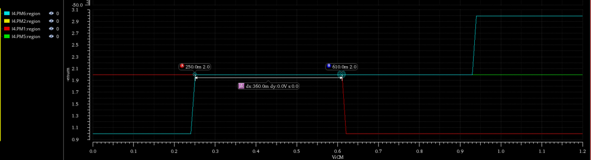

*	Input Pairs go into saturation after $V_{iCM_{min}}$ 

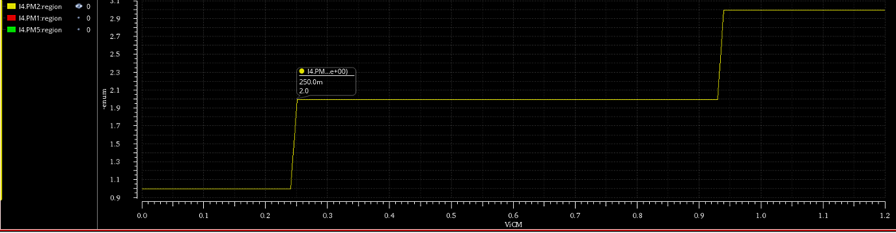

*   Current Source goes out the saturation region after the $V_{iCM_{max}}$ 

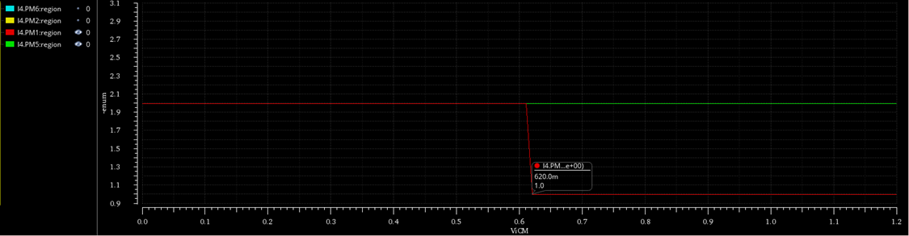

6. **CM large signal ccs (GBW vs Vicm)**

* Report CM large signal ccs (Avd vs Vicm). Assume the valid range for Vicm (CMIR) is defined by the condition that Avd is within 90% of the max gain, i.e., 10% drop in gain.
    * note this is done by AC analysis as mentioned in the lab pdf file
* CMIR = 304.7 : 690.84 mV

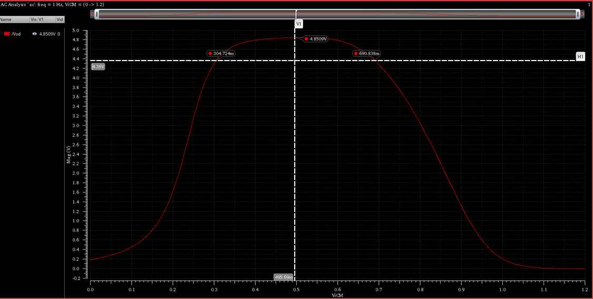

* GBW vs ViCM is more meaningful as it is related to the specs , even input pair went out the saturation region it still acceptable as the GBW is >= 90% from it’s max value

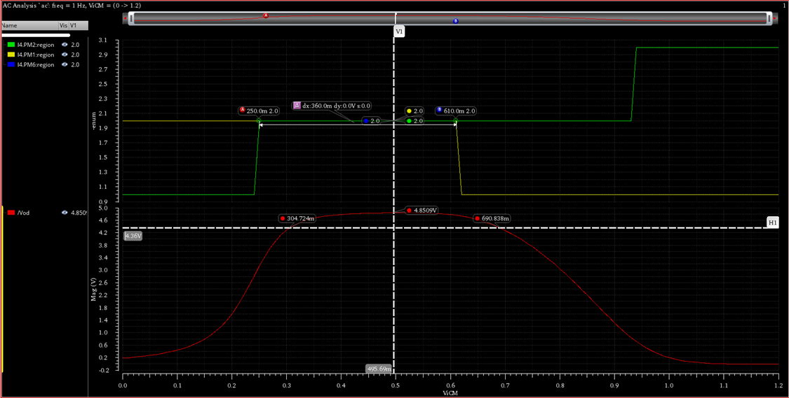