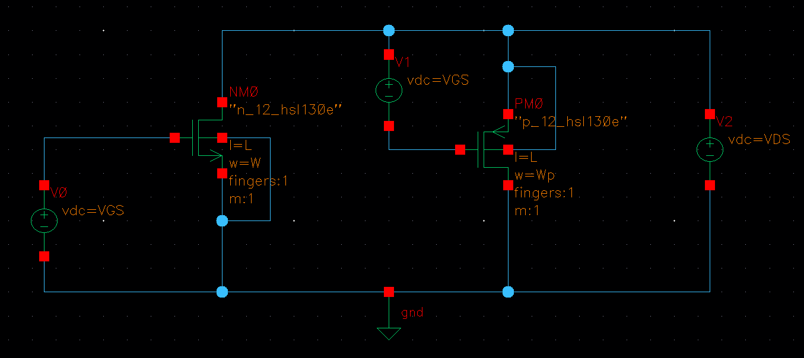
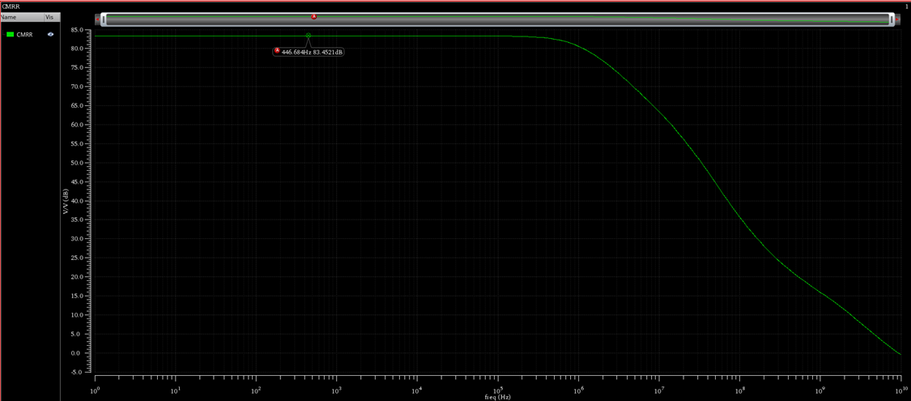
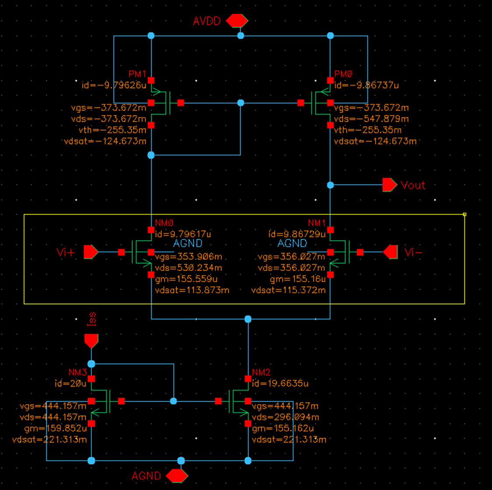

# # ITI LABs : [Lab 07 : 5T-OTA Design Using gm/ID Methodology](https://drive.google.com/file/d/125CBkopSgQUhAJLGeMgHtJgjInycvP_3/view?usp=drive_link)
*
## Content 

* [Objectives](#objectives)
* [Part I: gm/id Charts ](#part-i--gmid-design-curves) 
* [Part II: OTA Design ](#part-ii--ota-design)  
* [Part III: Open Loop Simulation ](#part-iii-open-loop-ota-simulation)   
* [Part IV: Closed-Loop OTA Simulatoin ](#part-iv--closed-loop-ota-simulation)   
* [Part V: Effect of Mismatch in CMRR (Optional) ](#part-v--effect-of-mismatch-on-cmrr-optional)   

## Objectives 

* Design and simulate a 5T OTA.
* Learn how to generate and use gm/ID design curves.
* Learn how to simulate the open-loop characteristics of the 5T OTA.
* Learn how to simulate the closed-loop characteristics of the 5T OTA.

## Part I : gm/ID Design Curves

* W = 10um
* L = 0.2μm:0.2μm:5μm → parametric sweep
* VGS ≈ 0:5m:1.2 → DC sweep
* VDS = VDD/3 

## Part II : OTA Design 

* **Specs**

|||
|-----|---|
|VDD|1.2V|
|Load|5pF|
|Open loop DC voltage gain|>= 34dB|
|CMRR @ DC|>= 74dB|
|Phase margin|>= 70 degree|
|OTA current consumption|<= 20uA|
|CM input range – low|<= 0.6V|
|CM input range – high|>= 1V|
|GBW|>= 5MHz|

* **Design Procedure**

1) **Choosing Architecture** 

* As the Vicm|min is high, Input Pair and Current Mirror load are chosen NMOS. {Note : Input Pair M1, M2, Load Pair M3, M4, Current Source M5}
* CMIR for NMOS OTA [ VGS1 + Vdsat5 ≤ ViCM ≤ VDD + Vthn -|Vthp|-|Vov3| ] 
* CMIR for PMOS OTA [ Vdsat1 - |VGS1| + |VGS3| ≤ ViCM ≤ VDD -|VGS1|-|Vdsat5| ]  
    * NMOW has Higher $V_{iCM_{min}}$ so the next topology will be used

    
-----------------------------
* The Testbench for generation gm/ID charts

2) **NMOS Input Pairs Design** 

* From GBW ≈ gm/(2π*CL) , CL =5pF and GBW = 5MHz
    * So, gm = 157 uS 
* ID = 10uA 
    * So, **gm/ID = 15.7** 
* Avd = gm(ro2||ro4) ≥ 34 dB ≥ 50.12 
    * Assume ro2 = ro4 so gds2 = gds4
    * **gm/gds ≥ 100.24**  → From gm/gds chart get **L**

* **L = 1.2um**
* gds2 = gds4 ≤ 1.566 uS 
* From ID/W (Current Density) chart, L =0.4um and gm/ID = 15.7 
    * ID/W = 2.1 , ID =10 uA, **W = 4.8μm**

* From VGS and Vdsat chart:
    * **|VGS| =318mV** 
    * **|Vdsat| =112.53mV** 

-----------------------------
3) **PMOS Current Mirror Loads Design**

* gds2 = gds ≤ 1.566 μS 
* Assume gm/ID relatively large *gm/ID = 15 * , ID =10 μA 
    * gm = 150 μS 
    * *gm/gds = 150/1.566 = 95.8*
        * **L = 1.2μm**

* From Vicm|max = 1 ≤ VGS1 - Vdsat1 - |VGS3| + VDD
* From Vicm|max = 1 ≤ 318mV - 112.53mV - |VGS3| + 1.2
    *  **|VGS3| ≤ 405.5mV** 
        * At VGS3 = 405.5mV  →  gm/ID = 11.12 
        * So we choose higher gm/ID = 13, *to take a margin in VGS3*    

* ID/W = 0.658 , ID = 10μA
    * **W = 15.2μm**

-----------------------------
4) **Tail Current Source Design**

* *Remember Current Source is NMOS*

* $A_{v_{CM}} = Avd - CMRR = 34 - 74 = -40 dB = 0.01$
    * AvCM = 1/(2gm3 * Rss) = 0.01
    * gds = 1/Rss = 1/ro5 < 3 μS 
    * Rss = ro5 = 1/(2* 150μS * 0.01) = 333.33 kohm
* Assume an arbitrary but large gm/ID, e.g., gm/ID = 15 & ID = Iss = 40μA
    * gm5 = 40 * 15 = 600 μS
* gm/gds = 600/3 > 200 
    * **L = 3.2μm** from gmro chart for the NMOS
* From ViCM|min = 600mV ≥ VGS1 + Vdsat5
* ViCM|min = 600mV ≥ 318mV + Vdsat5
    * |**Vdsat5| ≤ 600 - 318 = 282mV**  → gm/ID = 6.03
    * Choose higher **gm/ID = 8**, to take a margin at Vdsat5 = 221.1mV
* ID/W = 3.51 , ID = Iss = 20μA
    * **W = 5.7**

* **Sizing Summary**

|Input Pair|  |
|-------------------|--|
|W|4.8μm|
|L|1.2|
|gm/ID|15.7|
|gm|157μS|
|ID|10μA|
|VGS|318mV|
|𝑣𝑑𝑠𝑎𝑡|112.53mV|
|𝑉*|127.4mV|
|𝑉𝑜𝑣||

|Current Mirror Load|  |
|-------------------|--|
|W|15.2μm|
|L|1.2μm|
|gm/ID|13|
|ID|10μA|
|gm|130μS|
|VGS|375.3mV|
|𝑣𝑑𝑠𝑎𝑡|125.8mV|
|𝑉*|153.8mV|
|𝑉𝑜𝑣||

|Current Source|  |
|-------------------|--|
|W|5.7μm|
|L|3.2μm|
|gm/ID|8|
|ID|20μA|
|gm|160μS|
|VGS|442.2mV|
|𝑣𝑑𝑠𝑎𝑡|221.1mV|
|𝑉*|250mV|
|𝑉𝑜𝑣||

--------------------------------
## Part III: Open-Loop OTA Simulation

* **Testbench**

1) **DCOP**

2) **Diff small signal ccs**

* *Analytical Analysis*
    * Gain = Av = gm(ro2||ro4) = gm/(gds2+gds4) = 157/2.01 = 78.1
    * BW ≅ 1/(2π*Rout*Cout), Rout = ro2||ro4 = gds2+gds4 = 2.01μS , Cout ≅ CL =5pF
        * BW ≅ 63.98 kHz
    * GBW ≅ Av * BW = 78.1 * 63.98k = 4.997MHz

||Analytical|Simulation|
|--|--|--|
|Av|78.1|77.86|
|  |37.85dB|37.83dB|
|BW|63.98 kHz|63.1765 KHz|
|GBW|4.997MHz|4.93069M|

3) **CM small signal ccs**

* *Analytical Analysis*
    * AoCM = -1/(2gm3 * Rss) = -gds5/(2*gm3) = 1.52/(2\*129) = 5.89m
    * CMRR = (157/2.01)*(2*130/1.52) = 13.36k

||Analytical|Simulation|
|--|--|--|
|AoCM|5.89m|5.2322m|
|    |-44.597dB|-45.63dB|

* $V_{o_{CM}} vs V_{i{CM}}$ 

4) **CMRR**

* *Analytical Analysis*
    * CMRR = Avd - AoCM = 37.85dB - -44.597dB = 82.447dB = 13.254k 
    * or CMRR = gm1.(ro2||ro4).2gm3.Rss = (gm1/(gds1+gds2)).(2gm3/gds5) = (157/2.01)*(2*130/1.52) = 13.36k

||Analytical|Simulation|
|--|--|--|
|CMRR|82.447dB|83.45dB|

* CMRR vs ViCM
    * Comment: the OTA will work properly in the CMIR only

5) **Diff large signal ccs**

* Zoom in 

6) **CM large signal ccs**

* CMIR Analytically 
    *  VGS1 + Vdsat5 ≤ ViCM ≤ VGS1 - Vdsat1 - |VGS3| + VDD
    * 370.5 + 116.7 ≤ ViCM ≤ 370.5 - 116.7 - 375 + 1200
    * 487.2mV ≤ ViCM ≤ 1.08 mV

* 	Regions Vs ViCM 
	* 566mV ≤  ViCM  ≤ 1.1mV

* ??!?!?!

||Analytical|Simulation|
|--|--|--|
|CMIR|487.2mV : 1.08V|566mV : 1.1V|

## Part IV : Closed-Loop OTA Simulation

* **Testbench**

* The CM differs!

* Loop Gain

## Part V : Effect of Mismatch on CMRR (Optional)

